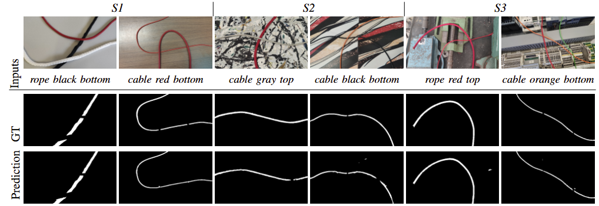
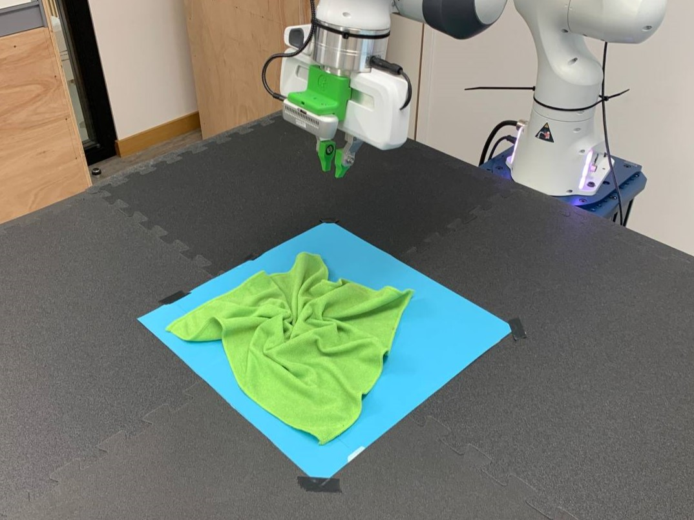
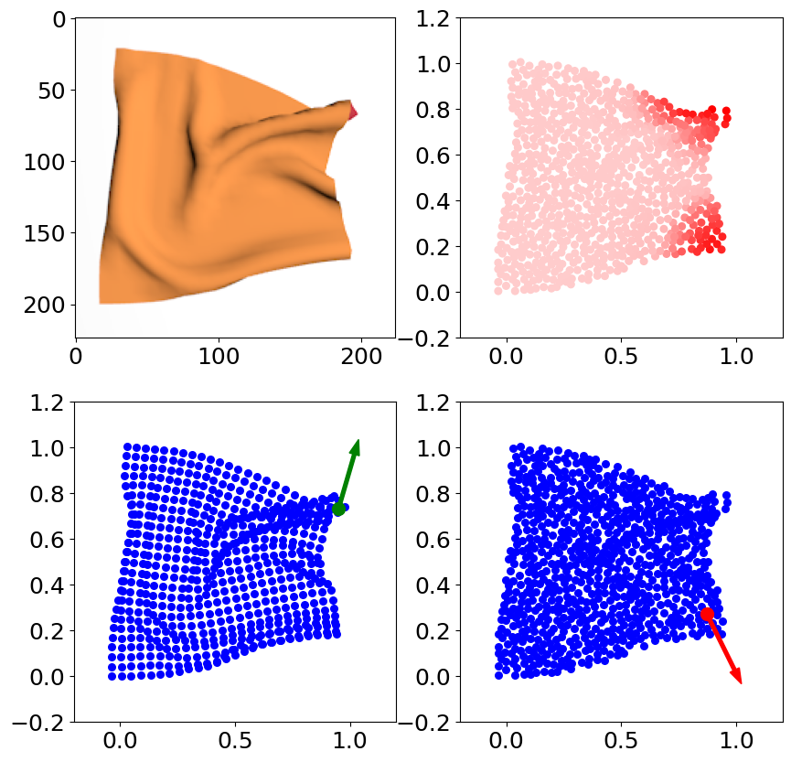

# Hello there 👋

I'm Kevin, I'm a PhD Student in artificial intelligence for industrial robotics in Bologna, Italy 

I'm currently working on manipulation and perception of deformable linear objects (DLOs) at the laboratory of Robotics of Bologna.
In the last year I worked on the use of LLM for the perception of deformable objects and in the manipulation of deformable objects such as clothes. 

  
  
<em> DLO-Perceiver: Grounding Large Language Model for Deformable Linear Objects Perception </em>

  
  
  
<em> Imitation Learning for Robotic Manipulation of Cloth-Like objects using Attention Models </em>

You can check the implementation in our laboratory's repository, just click in the image:

  

## Latest publications
- A. Caporali, K. Galassi, and G. Palli, **"DLO Perceiver: Grounding Large Language Model for Deformable Linear Objects Perception,"** in *IEEE Robotics and Automation Letters*, vol. 9, no. 12, pp. 11385-11392, Dec. 2024, doi: [10.1109/LRA.2024.3491428](https://doi.org/10.1109/LRA.2024.3491428).

- A. Caporali, K. Galassi, M. Pantano, and G. Palli, **"Deformable Objects Perception is Just a Few Clicks Away – Dense Annotations from Sparse Inputs,"** 2024 *IEEE/RSJ International Conference on Intelligent Robots and Systems (IROS)*, Abu Dhabi, United Arab Emirates, 2024, pp. 5880-5887, doi: [10.1109/IROS58592.2024.10802495](https://doi.org/10.1109/IROS58592.2024.10802495).

- K. Galassi, B. Wu, J. Perez, G. Palli, and J.-M. Renders, **"Attention-Based Cloth Manipulation from Model-free Topological Representation,"** 2024 *IEEE International Conference on Robotics and Automation (ICRA)*, Yokohama, Japan, 2024, pp. 18207-18213, doi: [10.1109/ICRA57147.2024.10610241](https://doi.org/10.1109/ICRA57147.2024.10610241).

<!--
**KevinGalassi/KevinGalassi** is a ✨ _special_ ✨ repository because its `README.md` (this file) appears on your GitHub profile.

Here are some ideas to get you started:

- 🔭 I’m currently working on ...
- 🌱 I’m currently learning ...
- 👯 I’m looking to collaborate on ...
- 🤔 I’m looking for help with ...
- 💬 Ask me about ...
- 📫 How to reach me: ...
- 😄 Pronouns: ...
- ⚡ Fun fact: ...
-->

<!--
_____________
## Techno music for coding

-->
_____________

<!--

## Some Stats

-->
